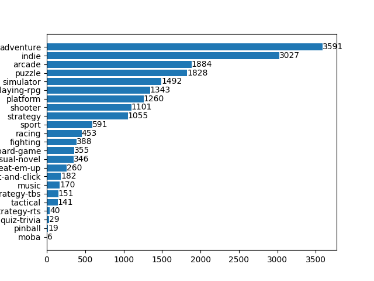

# Reporte de Datos

Este documento contiene los resultados del análisis exploratorio de datos.

## Resumen general de los datos
Se tienen 7303 covers de los videojuegos con los géneros asociados a este. Para esto se tuvieron en cuenta los siguientes aspectos:
1. Solo se tomaron los juegos de la última generación de consolas "Xbox Series S|X", "Nintendo Switch" y "Play Station 5".
2. Se tomaron todos los géneros posibles asociados. En este caso son 23 géneros. 

## Resumen de calidad de los datos
Se puede observar que se tiene una diferencia entre las imágenes y el dataset de metadata de los juegos. 
* Se tienen 7303 imágenes en el dataset que hacen referencia a las portadas de los videojuegos.
* Hay 7360 registros en el dataset de "games.csv".

## Valores faltantes

|  is_in_dataset 	| False 	| True 	|
|---------------:	|------:	|-----:	|
| is_in_imagenes 	|       	|      	|
|          False 	|     0 	|  285 	|
|           True 	|   228 	| 7075 	|
Por lo tanto, solo se toman los datos que están en común entre la metadata y las imágenes, es decir, 7075 datos. 

## Errores y duplicados

## Variable objetivo

## Variables individuales

## Ranking de variables

## Relación entre variables explicativas y variable objetivo

