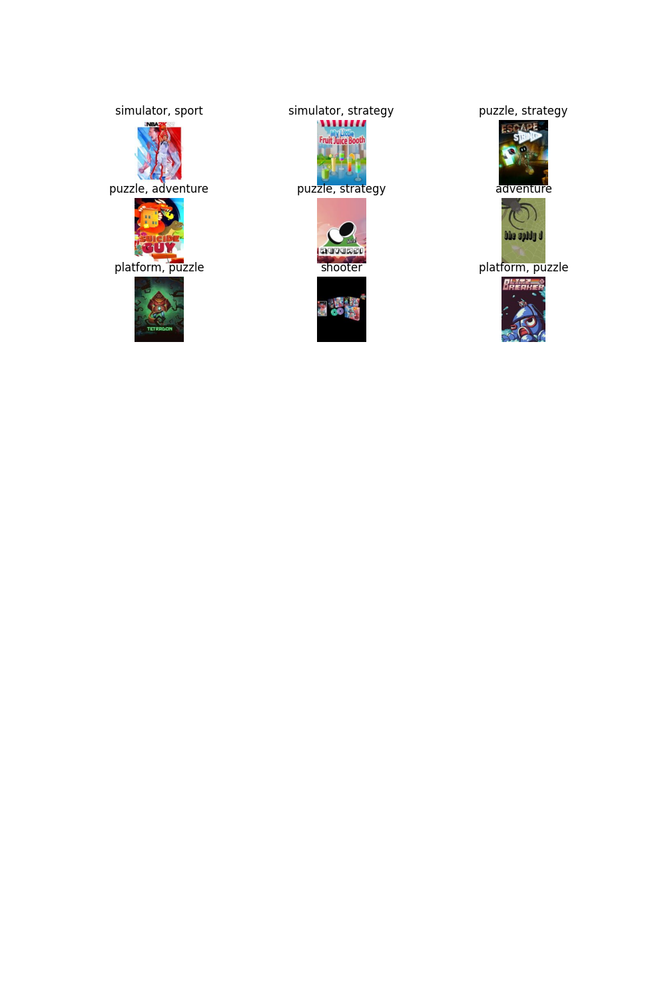

# Reporte de Datos

Este documento contiene los resultados del análisis exploratorio de datos.

## Resumen general de los datos
Se tienen 7303 covers de los videojuegos con los géneros asociados a este. Para esto se tuvieron en cuenta los siguientes aspectos:
1. Solo se tomaron los juegos de la última generación de consolas "Xbox Series S|X", "Nintendo Switch" y "Play Station 5".
2. Se tomaron todos los géneros posibles asociados. En este caso son 23 géneros. 
   

## Resumen de calidad de los datos
### Extensiones de los archivos: Imágenes
* Todos los archivos son .jpg 

| Extension | Cantidad |
|-----------|----------|
| .jpg      | 7303     |

Se puede observar que se tiene una diferencia entre las imágenes y el dataset de metadata de los juegos. 
* Se tienen 7303 imágenes en el dataset que hacen referencia a las portadas de los videojuegos.
* Hay 7360 registros en el dataset de "games.csv".
Estas diferencias pueden deberse a fallos con API al descargar los datos. 

## Valores faltantes

|  is_in_dataset 	| False 	| True 	|
|---------------:	|------:	|-----:	|
| is_in_imagenes 	|       	|      	|
|          False 	|     0 	|  287 	|
|           True 	|   212 	| 7091 	|
Por lo tanto, solo se toman los datos que están en común entre la metadata y las imágenes, es decir, 7091 datos. 

## Errores y duplicados
* Id de video juego:  No hay duplicados
* Cover name file: No hay duplicados
* Name of the game: Hay juegos repetidos

Como para el nombre de juego se repiten algunos registros, se dropearan los duplicados con respecto a este para que no se tengan más información de la cuenta. 

## Variable objetivo
Como se puede ver en el siguiente gráfico:
* La gran mayoría de géneros que vemos entre las categorías es adventure, indie y puzzle.
* Hay un desbalanceo grande entrelas diferentes clases, donde se puede observar algunas incluso con menos de 200 datos.
* Hay algunos géneros muy específicos como "hack-and-slash-beat-em-up"

Para tratar este desbalanceo, se buscará hacer dos cosas:
* Remover los géneros que tengan menos importancia o sean más específicos y no generen valor. 
* Usar class-weights en el entrenamiento del modelo para que así se puede mitigar el error. 

Luego de quedarnos solo con el top 12 de los géneros, tenemos lo siguiente:

Adicionalmente, removemos todos aquellos registros que al quedarnos con solo el top 12 de los géneros no tienen ningún género asignado. Para al final quedarnos con 6916 registros.

## Variables individuales
En este caso, las variables que explicarán el género son las imágenes. Para poder observar cómo se comportan los tamaños se hace el siguiente gráfico.

* Por como se trajeron los datos desde la API, se puede ver que los tamaños rondan en altura en 160 pixeles y en anchura en 280 pixeles. 
* Las imágenes son rectángulares, tocará tener esto en mente al hacer el resize para que puedan ingresar en las redes neuronales. 

## Relación entre variables explicativas y variable objetivo
Finalmente para poder evaluar la relación que puede haber entre las imágenes y el target, se toma una muestra de 9 imágenes con hasta 2 géneros asignados.
* A simple vista, pareciera que los juegos tipo puzzle tienen imágenes como más de tipo animación. 
* Los juegos de tipo deporte, probablemente tendrán gráficos más "realistas" y tendrán algún tipo de implemento deportivo como el de NBA. 

