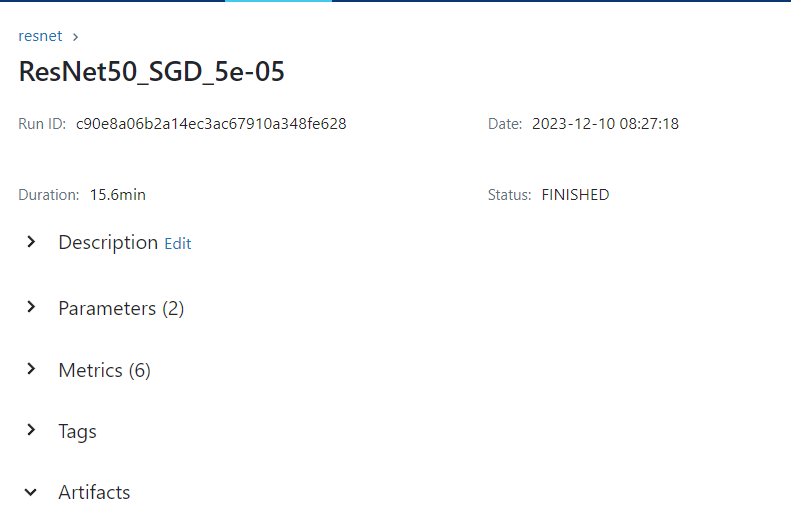

# Reporte del Modelo Baseline

Este documento contiene los resultados del modelo baseline.

## Descripción del modelo

Para la construcción del modelo se probaron 3 modelos preentrenados para realizar TransferLearning:
* ResNet
* EfficientNet
* MobileNet

Con estos tres modelos se les removió la última capa y se crearon unas cuantas adicionales. Es importante adicionar que este será un modelo MultiLabel, lo que implica que puede tener más de un output, esto se abordará usando una función de activación "sigmoid".

Finalmente, como existía un desbalance en las clases, se aplicó class-weights para poder mitigar un poco esto en el entrenamiento.

## Variables de entrada
El modelo tiene como entrada imágenes que deberán tener el tamaño de (224, 224, 3) para poder ingresar a la red y entrenar los modelos.

## Variable objetivo
La variable objetivo será los posibles géneros del modelo. Estos pueden ser variables y un juego tener por ejemplo 3 géneros asignados y otro juego puede tener 1 género asignado. 

## Evaluación del modelo

### Métricas de evaluación

El modelo se evaluará en MLFLow con las métricas:
* AUC (Para Multilabel) - Se tratan cada una de las clases como individuales.
* Accuracy
* Loss

Adicionalmente compararemos los modelos finales de cada una de las redes con las métricas de 
* F1
* Recall
* Precision

### Resultados de evaluación
Se entrenaron 3 modelos y dentro de cada uno de estos se hizo una variación de los hiperparámetros
#### ResNet
Para ResNet solo se varió el learning rate, ya que en pruebas iniciales, cuando se tenía un optimizador de tipo Adam, no dió los resultados esperados, por lo tanto, se tuvo los siguientes modelos:
* ResNet50_SGD_1e-06
* ResNet50_SGD_1e-05
* ResNet50_SGD_5e-05

De los cuales, el modelo que tuvo los mejores resultados fue "ResNet50_SGD_5e-05". El cual se puede ver un AUC de 0.5 y un val_accurracy de 0.5. Lo cual indica que debe haber un problema con el desbalance de las clases.

#### EfficientNet
Para EfficientNet solo se varió el learning rate, ya que en pruebas iniciales, cuando se tenía un optimizador de tipo Adam, no dió los resultados esperados, por lo tanto, se tuvo los siguientes modelos:
* EfficientNet_SGD_1e-06
* EfficientNet_SGD_1e-05
* EfficientNet_SGD_5e-05

De los cuales, el modelo que tuvo los mejores resultados fue "EfficientNet_SGD_5e-05". El cual se puede ver un AUC de 0.5 y un val_accurracy de 0.41. Lo cual indica que debe haber un problema con el desbalance de las clases.

#### MobileNet
Para MobileNet se varió el learning rate y el optimizador, se tuvo los siguientes modelos:

* MobileNet_SGD_1e-06
* MobileNet_SGD_1e-05
* MobileNet_SGD_5e-05
* MobileNet_Adam_1e-06
* MobileNet_Adam_1e-05
* MobileNet_Adam_5e-05

De los cuales, el modelo que tuvo los mejores resultados fue "MobileNet_Adam_5e-05". El cual se puede ver un AUC de 0.5 y un val_accurracy de 0.51. Lo cual indica que debe haber un problema con el desbalance de las clases.

## Análisis de los resultados
Se puede ver que para los 3 modelos resultantes de cada uno de los modelos preentrenados los resultados no son muy buenos. Para poder compararlos entre ellos, tomamos los datos de test y hacemos un classification_report con los cuales podremos observar mejor sus fortalezas y fallos por cada una de las categorías.

Los tres modelos se vieron muy afectados por el desbalance de las clases, donde las cateorías con menos datos como la 0 (Fighting) o la 4 tienen una precision demasiado baja.

Como modelo final, revisando los resultados de recall y precision. Me quedaría con el Resnet. Ya que al revisar en promedio el micro avg f1 y macro avg f1 son los que mejores resultados tienen. 
## Conclusiones

* El modelo no funciona bien debido al desbalance de las clases, para esto se podría generar más datos de un poco más de historia y ver si eso pueda solucionar un poco el desbalance. 
* Los resultados con los modelos preentrenados no fueron muy altos, se podría buscar o crear una red desde cero o buscar hacer un fine-tuning como próximos pasos.
