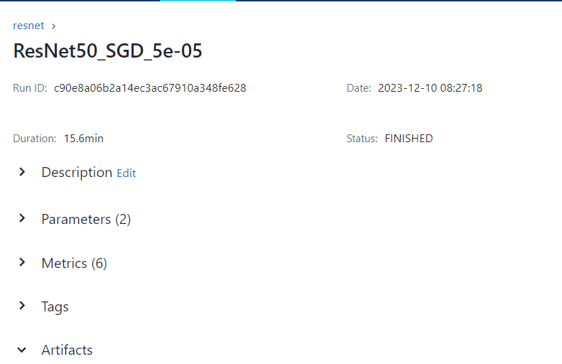
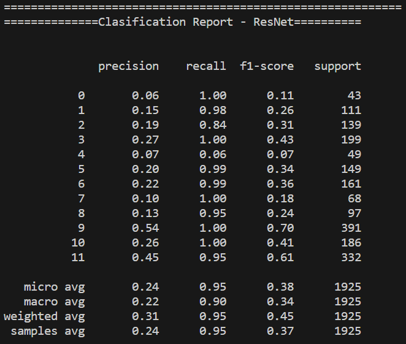

# Reporte del Modelo Final

## Resumen Ejecutivo

## Descripción del Problema

Se busca un modelo que pueda predecir los posibles géneros de un juego a partir de su portada. 

## Descripción del Modelo

Se uso un modelo preentrenado de ResNet con transfer learning sobre la última capa, es un modelo Multi-Label que tendrá de forma independiente cada uno de los outputs. 

## Evaluación del Modelo
El modelo se evalúo mediante diferentes métricas como Accuracy, AUC, Recall, Precision y F1. En donde se puede ver que el modelo tiene muchas oportunidades de mejora y tuvo varios problemas aprendiendo debido a la gran cantidad de categorías y el desbalance. 

## Conclusiones y Recomendaciones

Se podría intentar correr un modelo a través de Fine Tuning con la ResNet porque tal vez así pueda aprender mejor el problema, para esto adicionalmente se debe aumentar el dataset y tener más imágenes por cada categoría. 
